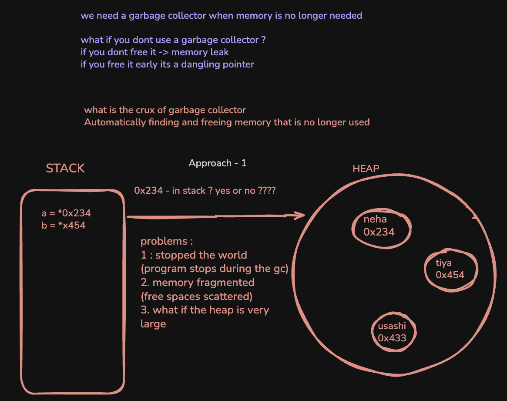
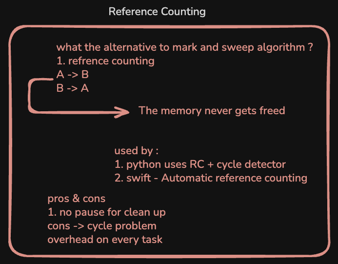
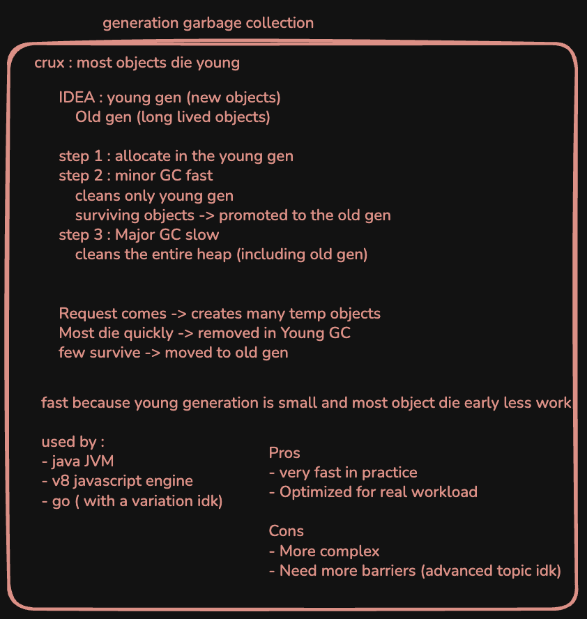
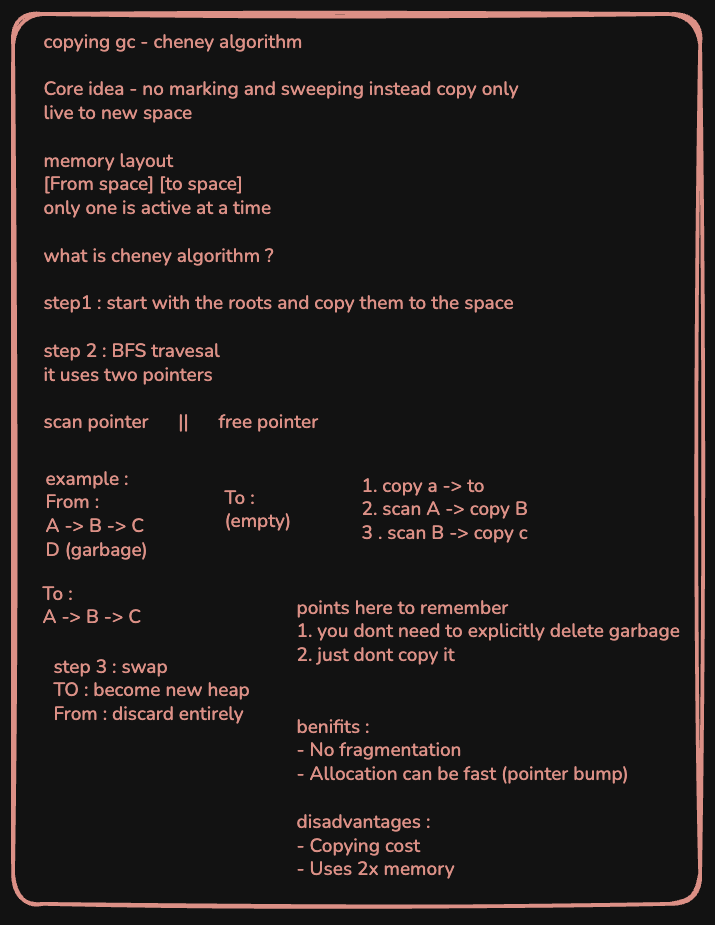
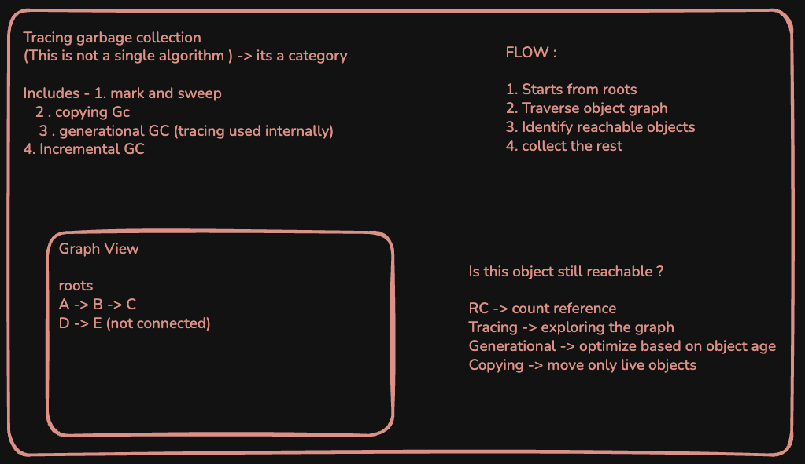

# Garbage Collector Implementation in Rust

This repository contains implementations of five distinct garbage collection algorithms from scratch using Rust. Each approach demonstrates unique memory management strategies and trade-offs.

## Implemented Algorithms

### 1. Mark and Sweep
The Mark and Sweep algorithm is a tracing garbage collector that works in two phases. In the mark phase, the collector traverses the object graph starting from roots and marks all reachable objects. In the sweep phase, it deallocates objects that were not marked.



### 2. Reference Counting
Reference Counting tracks the number of references to each object. When an object's reference count drops to zero, it is immediately deallocated. This approach provides deterministic destruction but can struggle with circular references.



### 3. Generational Garbage Collection
Generational GC is based on the generational hypothesis that most objects die young. It divides the heap into generations (e.g., young and old) and collects the younger generation more frequently to improve performance.



### 4. Cheneys Algorithm
Cheney's algorithm is a semi-space copying collector. It divides available memory into two equal halves. During collection, it copies live objects from the from-space to the to-space, effectively compacting memory and eliminating fragmentation.



### 5. Tracing Garbage Collection
This implementation explores general tracing techniques to identify reachable objects within the heap. It serves as a foundation for more complex collectors, focusing on efficient graph traversal and reachability analysis.



## Getting Started

### Prerequisites
* Rust compiler (latest stable version recommended)
* Cargo package manager

### Installation
Clone the repository:
```bash
git clone https://github.com/your-username/garbage-collector-rust.git
cd garbage-collector-rust
```

### Usage
Run the implementations using Cargo:
```bash
cargo run
```

## License
This project is licensed under the MIT License.
