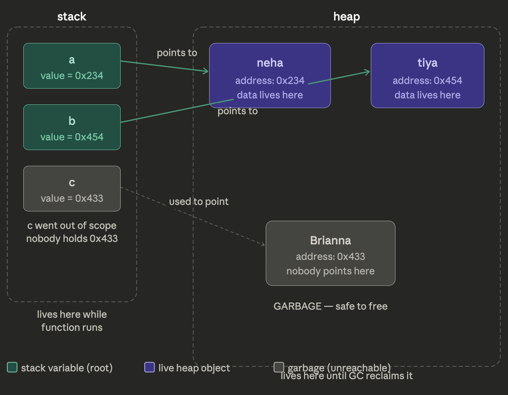

# What is the stack? 

The stack is where your local variables live things your function declared. a, b, c in your drawing are stack variables. They are tiny. They don't hold the actual data. They only hold one number an address.

When a function returns, the stack is wiped. a and b are gone. But the heap objects they were pointing to? Still sitting there unless the GC cleans them up.

## What is a pointer?

a = *0x234 means: a is a variable that holds the number 0x234. That number is a memory address it tells the CPU "go to location 234 in memory and read what's there." The * means "the thing at this address."

So a itself = just the number 0x234 (tiny, lives on stack).
*a = whatever is sitting at address 0x234 on the heap — that's neha, the actual object with real data.

# What does the heap object actually look like?

In a real program, neha at 0x234 is a raw chunk of bytes  your data plus a hidden header. In your Rust simulation, since you can't use raw pointers safely, you replace the real address 0x234 with an integer ID. So neha becomes:

```
Object {
    id: 0,           // this IS your 0x234 — the "address"
    size: 32,        // how much memory she takes
    marked: false,   // GC bookkeeping
    ref_count: 1,    // 'a' points here, so 1
    children: [],    // neha doesn't point to anyone else
    generation: 0,
    forwarding_ptr: None,
}
```

And the heap is :

```
Heap {
    objects: {
        0 => neha_object,    // key 0 = address 0x234
        1 => tiya_object,    // key 1 = address 0x454
        2 => brianna_object,  // key 2 = address 0x433
        },
        next_id: 3,
        }

        # visualisation
        ```
        STACK                    HEAP
        ─────────────────        ──────────────────────────────────
        a = 1    ───────────────→  id=1  (neha, size=32, children=[0])
        b = 0    ───────────────→  id=0  (tiya, size=16, children=[])
                           id=2  (brianna, size=8, children=[])  ← garbage
        ```

        # What are a and b in your Rust code?
        They are your roots array. When you call:
        ```
        rustgc.collect(&[0, 1])
        ```
        That 0 is a (pointing to neha). That 1 is b (pointing to tiya). You're telling the GC — "these are the stack variables that are currently alive. Start from here."
        brianna has id 2. Nobody put 2 in the roots list — because c went out of scope. So the GC can't reach her. She's garbage.

        # How does get and delete work?
        ```
        // GET — follow the pointer (dereference *0x234)
        let neha = heap.objects.get(&0);

        // DELETE — GC sweeps unreachable objects
        heap.objects.remove(&2);  // brianna is gone, memory reclaimed
        ```
```

# The complete picture in one sentence

The stack holds variables (a, b) which are just numbers (addresses/IDs). Those numbers point into the heap where the real objects (neha, tiya) live. Any heap object that no stack variable directly or indirectly points to is garbage. Your GC's entire job is to find those and call .remove() on them.